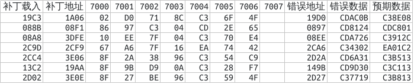

Title: GameBoy的7000中文加密卡小结
Tags: GameBoy, 知乎
Slug: zhihu-gameboy-7000-cncard
Image: ../images/GameBoy/zhihu-gameboy-7000-cncard-title.png

从朋友那里弄到了几个GameBoy的加密卡ROM，研究了几天，因为这些加密卡ROM的共性是往7000-700F端口写入相关加密代码，暂且称其为7000中文加密卡。
因为卡带头数据诡异地来自于牧场物语GB2，所以如果你开心的话，叫他牧场2变异卡什么的也是可以的。

虽然没什么重要的进展，姑且把目前已经研究出来的先记录下来。

# HomeBank的障眼法


> 开机画面，下方的Nintendo图案数据来自于卡带

标准的MBC基本不存在对HomeBank的改动（除了MBC1的某种特殊模式），开机之后HomeBank就保持不变，HomeBank有一个区域用来存放Nintendo标志的图案数据，这个数据首先会被装入显存显示在屏幕上，然后GameBoy会判断这个图案数据和机器自带的Nintendo图案数据是否相同，如果有差异，游戏就不会正常进入。

往好了说，这个图案可以用来快速检测卡带是否正常，毕竟如果卡带有损坏或者没插好的话，这个图案的显示就会很奇怪了。
但是从另一方面，这个图案可能也是任天堂用于版权控制的一部分，或许任天堂想用这种让卡带强制嵌入Nintendo数据的方式来让盗版/未授权卡带在版权诉讼上处于劣势。

中文卡肯定是不满足于此的，虽然看上去外星科技和其他中文卡生产商并不在乎八百里外的什么任天堂版权（因为校验总是要用到Nintendo图案数据），但是他们仍然想要显示自己的LOGO来代替启动时的Nintendo，同时还能正常进入游戏。
中文卡生产商找到了一种办法，那就是动态替换HomeBank的数据。读取Nintendo标志送屏显的程序和检测标志是否正常并不是同时进行的，所以在送显时HomeBank里还是厂商自家数据，送显完后更改HomeBank数据为原始Nintendo图案数据逃避检验，就能达成又显示自制LOGO又能通过检测的效果。


> 骊城工贸的Niutoude图案，还别说他们真的在国内注册了这个商标。
> 另外这个标志实际上可以不需要任何辅助就能直接通过GameBoyColor校验，但是理论上想通过GameBoy校验还是得用上面的方法才行。

我这边其实还有那么几个有趣的LOGO图案，不过限于授权等原因，就不能贴出了，对这个感兴趣的可以去了解Neo Fuji的这篇文章《[Go Go Logo](http://fuji.12bit.club/?tag=researchshit)》。

# 7000中文加密卡

既然实现了HomeBank的替换，那么利用这种方式来做加密也是很自然的事情。7000中文加密卡就利用这种方式来实现加密。
GameBoy到了Color时代，采用的主流MBC是MBC5，这是一款兼容MBC1的Mapper，但是MBC1中部分老旧的端口范围在MBC5中被废弃，比如原本作为RAM/ROM切页模式更改的`7000-7FFF`端口段在MBC5中执行是没有效果的。

中文加密卡重新利用了这个端口段，默认在HomeBank的部分代码是完全错误的，要么执行完所谓的“程序”后剩下的根本不是可执行代码，要么直接跳转到一个会死机的位置。
但是在实机运行程序快执行到错误代码的地方会有一个特殊的程序调用，这个程序会执行`7000`相关端口的操作，将错误代码通过类似热补丁的方式修正为正确代码。
没有实现这个`7000`相关端口的模拟器以及直接读出ROM数据放入普通MBC5卡带会导致写入`7000`端口的操作完全无法生效，进而导致程序出错。

# 写入细节

下面这段是`7000`端口的写入代码。

```asm
push af
push bc
push de
push hl
ld   a,[de]     ;读取热补丁长度
add  a,$03      ;加3，猜测热补丁前3字节意义和余下有差异
ld   c,a
inc  de
ld   h,$70      ;设置写入目标为端口7000
ld   l,$00
ld   [hl],$96   ;往7000写入96，意义不明，猜测为关闭写保护
inc  l
@A
ld   a,[de]     ;从(de)读取并写入(hl)
ldi  [hl],a
inc  de
dec  c
jr   nz,@A
ld   l,$00
ld   a,[de]
ld   [hl],a     ;往7000写入热补丁最后一个字节，意义不明
ld   l,$0F
ld   [hl],$96   ;往700F写入96，意义不明，猜测为打开写保护
pop  hl
pop  de
pop  bc
pop  af
ret
```

整个程序的流程大概如下，这里的`de`为刚进入这个程序时寄存器de的值，为表述方便，下面的流程中`de`的值保持不变：

1. 从`(de)`获取热补丁长度`PL`，
2. 往`(7000)`写入`96h`
3. 往`(7001)`到`(7001+3+PL)`写入`(de+1)`到`(de+3+PL)`
4. 往`(7000)`写入`(de+4+PL)`
5. 往`(700F)`写入`96h`，完工。


# 分析

目前碰到的热补丁长度都是3，不算首尾的96h的话，程序实际写入了3+3+1个字节。
代码本身的执行，还是让我感觉有些懵的，暂时又无从得知其具体的运作方式（我也并没有什么办法知道什么元件能够写96h来开关写保护），只能由果溯因了。

根据发现的补丁，和某个正确执行的ROM比较确定其实际的预期数据，整理如下：



这张表格中，“补丁载入”是指将补丁地址装入寄存器的代码位置，“补丁地址”指的是补丁所在的地址，“错误地址”指的是错误指令所在的地址，“错误数据”是其数据，“预期数据”是若成功打上补丁所该实现的预期值。
另外，实际程序中，忽略首尾固定写入的`96h`，`7000`的数据实际上是最后一个写入的，表格没有体现出来。

从表格中，目前已经算是能破译出来的写入数据如下 （已过时，见[总结](./GameBoy的7000中文加密卡总结.md)）：

- `7001`：错误地址的低位。
- `7003`：错误地址的高位，但是需要做一次循环左移才是真实数据。
- `7004`：预期数据的第一个字节。
- `7006`：（新）当中的bit5和6 取反后对应预期数据的第二个字节的bit5和6。
- `7000`：（新）预期数据的第三个字节，做一次循环左移后`XOR 00001100B`才是真实数据。

至于剩下的位置所赋予的意义如何，暂时还没破译出来。

目前的难点就在于预期数据的恢复，目前错误发生的位置已经可以能计算出来，如果能完成对如何获取预期数据的分析，就可以修复这些ROM了，不过这还是要靠更多的数据，以及够大的脑洞才能分析出来吧。

目前只能先将写入的前三个字节和其余字节进行分离，并且假定卡带使用的是较为简单的元件实现这样的操作（而不是通过另外的存储元件中的数据来实现替换），希望最后能够真正破译这些写入数据的意义。

## 170909更新

刚刚脑洞一开，就解出了第三个字节的数据含义。

由于热补丁格式多是更改原始指令为跳转类指令，跳转类指令的写法是 CD XY ZW。

对应的具体跳转指令是jp $ZWXY，ZW能确定的话，相当于能确定跳转的大概位置（跳转的目标就在ZW00-ZWFF之间），对破解猜测帮助很大。
如果能破解最后一个字节，那么游戏的热补丁修正就能完全完整，目前的话只能靠手动判断的方式来打热补丁，刚刚就尝试成功了一个ROM。

## 240727更新

今天研究《剑侠情缘》，尝试将第二个字节也解密。

虽然没成功，但是至少解析出了两个bit，这样更容易解密了一些。

## 240731更新

发现 `HhugBoy` 里有完整的解密算法，我的猜测方法问题还挺多的。

我没有拿到过任何一张真的外星卡带，所以只能靠纯猜测的方法来解密。

好在之前发布的 [剑侠情缘](./GameBoy的剑侠情缘加密卡分析汇总.md) 和 [最终幻想](./GameBoy的最终幻想加密卡分析汇总.md) 都猜对了。

最新的情况，查看 [GameBoy的7000中文加密卡总结](./GameBoy的7000中文加密卡总结.md) 吧。

这边不再需要更新了。
