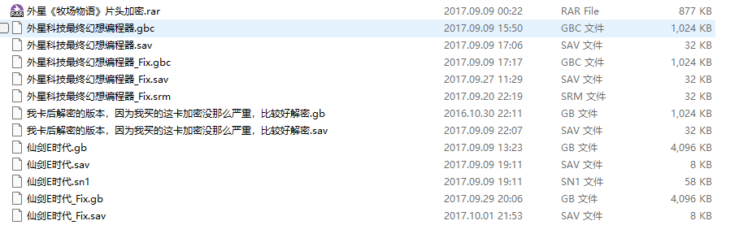

Title: GameBoy的7000中文加密卡总结
Tags: GameBoy
Slug: zhihu-gameboy-7000-cncard-final
Image: ../images/GameBoy/zhihu-gameboy-7000-cncard-title.png
Summary: 力大砖飞。

相比于猜测，还是直接有卡好处理。我是没有卡的，所以只能靠猜，如果手上真的有卡会好弄一些。

`HhugBoy` 在前年已经更新了[代码](https://github.com/tzlion/hhugboy/blob/master/src/memory/mbc/MbcUnlVf001.cpp)，里面有完整的解密方法。

照着他的方法编写了新的代码。 在 `HhugBoy` 里把加密方式称为广誉的加密方式。

我也不知道外星用的加密和广誉到底是什么关系，本来外星在GB上就有不少东西是广誉授权的。

# 加密解析以及问题复盘

```asm
MACRO wx_hotpatch

; Based on https://github.com/tzlion/hhugboy/blob/v1.4.0/src/memory/mbc/MbcUnlVf001.cpp

IF WXHP_TYPE == 0
    DEF WXHP_VALUE = $00
ELIF WXHP_TYPE == 1
    DEF WXHP_VALUE = $10
ELSE
    DEF WXHP_VALUE = $00
ENDC

DEF WXHP_REG_WADDR = $7001
DEF WXHP_REG_OFFSET = 2
PRINT "WXHP_REG_700X:" 
REPT \1 + 4
    DEF WXHP_VALUE = ((WXHP_VALUE & $01) << 7) | ((WXHP_VALUE & $FE) >> 1)
    DEF WXHP_VALUE = WXHP_VALUE ^ \<WXHP_REG_OFFSET>
    DEF WXHP_REG_{04X:WXHP_REG_WADDR} = WXHP_VALUE
    PRINT "[{04X:WXHP_REG_WADDR}]{02X:WXHP_VALUE} "
    DEF WXHP_REG_OFFSET = WXHP_REG_OFFSET + 1
    IF WXHP_REG_OFFSET != \1 + 5
        DEF WXHP_REG_WADDR = WXHP_REG_WADDR + 1
    ELSE
        DEF WXHP_REG_WADDR = $7000
    ENDC
ENDR

PRINTLN ""

DEF WXHP_BANK = WXHP_REG_7003
DEF WXHP_ADDR = (WXHP_REG_7002 << 8) | WXHP_REG_7001
DEF WXHP_LENGTH = WXHP_REG_7000 & 7 - 3

PRINT "Patch to {02X:WXHP_BANK}:{04X:WXHP_ADDR}: "

    org WXHP_ADDR, WXHP_BANK
HotPatch_{02X:WXHP_BANK}_{04X:WXHP_ADDR}:
DEF WXHP_REG_INDEX = $7004
REPT WXHP_LENGTH
    PRINT "{02X:WXHP_REG_{04X:WXHP_REG_INDEX}} "
    db WXHP_REG_{04X:WXHP_REG_INDEX}
    DEF WXHP_REG_INDEX = WXHP_REG_INDEX + 1
ENDR
PRINTLN ""

ENDM
```

实际上数据的解密比我想象中简单，原来是读入的数据先循环右移。然后和上一次的数据进行异或，就是本次的数据。

修订后的定义是这样的：

- `$7001`：错误地址的低位。
- `$7002`：错误地址的高位。
- `$7003`：错误地址的bank。
- `$7004`：预期数据的第一个字节。
- `$7005`：预期数据的第二个字节。
- `$7006`：预期数据的第三个字节。
- `$7007`：预期数据的第四个字节。（一般没有）
- `$7000`：低3bit是数据的长度。

而下面是原先的猜测，差别实际上很大。

- `$7001`：错误地址的低位。
- `$7003`：错误地址的高位，但是需要做一次循环左移才是真实数据。
- `$7004`：预期数据的第一个字节。
- `$7006`：当中的bit5和6 取反后对应预期数据的第二个字节的bit5和6。
- `$7000`：预期数据的第三个字节，做一次循环左移后`XOR 00001100B`才是真实数据。

差异很大，我还没有仔细分析具体的原因。
大概原因是 `$7003` 作为错误地址的bank，代码中普遍是bank0，所以这个数据是 `$00`。这导致错误地址的高位数据反倒在 `$7003` 中可解（相当于要一个数据，和 `$7003` 异或后使数据为 `$00`）；

也使得预期数据的第一个字节可解（因为是用 `$00` 异或的结果，相当于没区别）；

由于第一个字节是 `$0000 - $3FFF` ，最高的两位始终是0，这也导致第二个字节最终的bit5和6始终是取反的数据。

而最后一个字节的数据，由于在补丁长度为3的时候始终是 `$06` ，所以最终结果会表现出第三个字节的数据来。

对比了一下之前弄的 [剑侠情缘](./GameBoy的剑侠情缘加密卡分析汇总.md) 和 [最终幻想](./GameBoy的最终幻想加密卡分析汇总.md) 。
猜测的数据和预期一致。
最强的一点是最终幻想里有一个写内存的猜测竟然真的猜中了（这下不用发V2修正版了）。

另外还有一些更多的加密实现，还要消化消化，后面慢慢看。

其他的一些卡，这个周末可以尽量破解一些。
以前发布过的ROM也翻出来重新校验一把吧，也许要时隔8年发布V2修正版了。

# 旧日时光



看到这些内容，我就想起当年还在大学的时候，还是和……一起完成上面的解密的，用了一张没加密的外星卡带和加密卡带做数据对比。
就这么获取的第一手解密数据，然后对其他卡进行猜测。最终，才有的第一批外星解密ROM。

虽然现在回看，上面的猜测不尽如人意，但是还算成功地解密了一些ROM。

这样的日子再也不会回来了。我很怀念，也很遗憾。
