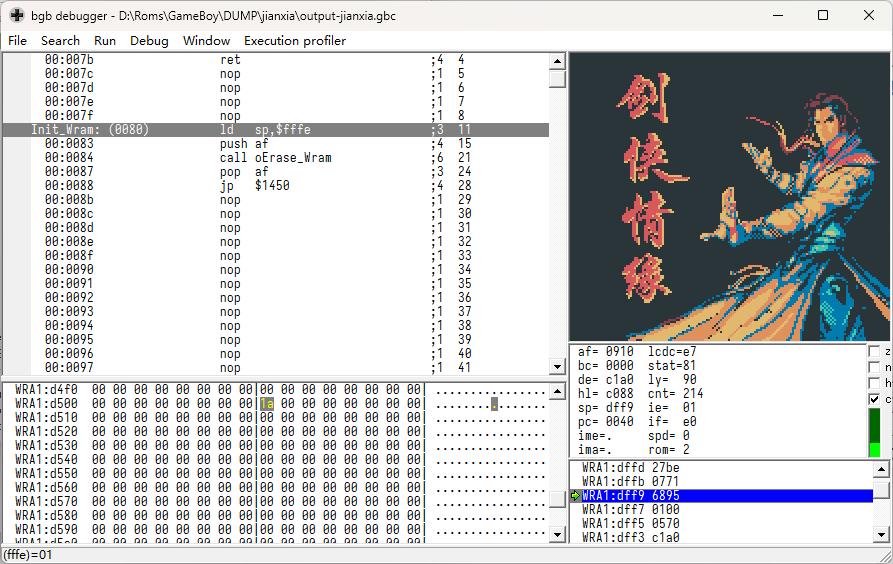
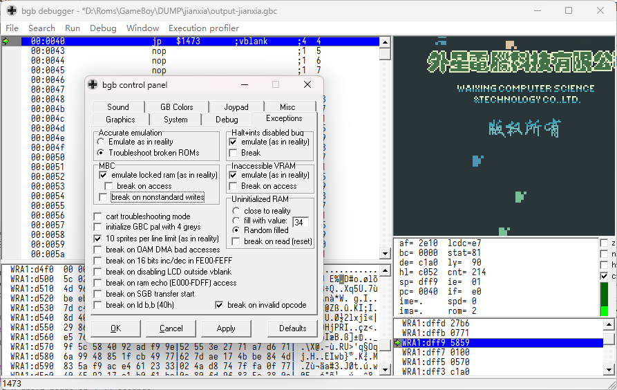

Title: GameBoy的剑侠情缘加密卡分析汇总
Tags: GameBoy, 加密
Slug: gameboy-jianxia-analyze
Summary: 剑侠情缘的加密和外星7000基本没有区别，只是需要额外做内存初始化。



一个应该是外星科技出的游戏，加密方式和 [外星的其他7000中文加密卡](./GameBoy的7000中文加密卡小结.md) 一样。

这次的研究，虽然还是没有突破第二个字节的加密，不过破解了其中两个bit，
可以用于验证猜测的第二个数据是否可靠。

# 7000加密

编写了一段代码，用于将Patch的代码转换为修订后的补丁。

```asm
; 0x96      -> $7000 : 开始补丁？
; hp[1 - 1] -> len   : 补丁长度，一般是3，实际写入多3
; hp[2 - 1] -> $7001 : 补丁目标地址的低位
; hp[3 - 1] -> $7002 : ？
; hp[4 - 1] -> $7003 : 补丁目标地址的高位，需要循环左移一次
; hp[5 - 1] -> $7004 : 补丁目标数据的第一个字节
; hp[6 - 1] -> $7005 : BIT5和6 取反为第二个字节的 BIT5和6
; hp[7 - 1] -> $7006 : ？
; hp[8 - 1] -> $7000 : 补丁目标数据的第三个字节，需要循环左移后 xor $0c
; 0x96      -> $7000 : 应用补丁？
MACRO wx_hotpatch
DEF WXHP_ADDR_L = \2
DEF WXHP_ADDR_H = (((\4) << 1) & $FE) | (((\4) >> 7) & $01)

IF \1 >= 1
DEF WXHP_DB_0 = \5
ENDC

IF \1 >= 2
    IF ((\6 ^ $FF) & $60) != ((WXHP_DB_1) & $60)
        FAIL "WXHP_DB_1 is wrong!"
    ENDC
ENDC

IF \1 >= 3
DEF WXHP_DB_2 = (((\8) << 1) & $FE) | (((\8) >> 7) & $01) ^ $0c
ENDC


DEF WXHP_ADDR = (WXHP_ADDR_H << 8) | (WXHP_ADDR_L)
DEF WXHP_DB_INDEX = 0

PRINTLN "Patch to {02X:WHXP_BANK}:{04X:WXHP_ADDR}"

    org WXHP_ADDR, WHXP_BANK
HotPatch_{02X:WHXP_BANK}_{04X:WXHP_ADDR}:
REPT \1
    db WXHP_DB_{d:WXHP_DB_INDEX}
DEF WXHP_DB_INDEX = WXHP_DB_INDEX + 1
ENDR

ENDM
```

由于Patch中的第二个字节的含义还没猜测完全，只能在生成前手动指定具体的值。
这个值只能通过调试来猜测。猜测的数据通过 `WXHP_DB_1` 来定义。

```asm
    ; Patch at $146b
    DEF WHXP_BANK = 0
    DEF WXHP_DB_1 = $a6
    wx_hotpatch $03, $68, $20, $0a, $c3, $47, $4b, $0a

    ; Patch at $18cf
    DEF WXHP_DB_1 = $5e
    wx_hotpatch $03, $cc, $7e, $0c, $c3, $bf, $0c, $97

    ; Patch at $18d7
    ; Same as 18cf 
    ; wx_hotpatch $03, $cc, $7e, $0c, $c3, $bf, $0c, $97

    ; Patch at $237a
    DEF WXHP_DB_1 = $80
    wx_hotpatch $03, $77, $98, $91, $c3, $61, $67, $95

    ; Patch at $27ce
    DEF WXHP_DB_1 = $A3
    wx_hotpatch $03, $cb, $c2, $93, $c3, $42, $d9, $02

    ; Patch at $089b
    DEF WXHP_DB_1 = $06
    wx_hotpatch $03, $d7, $e3, $04, $cd, $e0, $2f, $10
```

由于第一个字节和第三个字节已解密，第一个字节一般是 `JP XYZW` 命令，第三个地址是 `XY` 的数值。

因此，命令就变成 `JP XY00` 到 `JP XYFF` 范围内的空间。
这个空间内作为代码入口的位置只是不多，可以很快分析出来。
这个游戏还比较楞，做了连续的加密，实际上反倒降低了解密的难度，
因为你只要到目标位置直接找调用加密程序的代码，往前找这个代码的入口就可以了。

这次分析的过程还破解了第二个字节的部分bit，因此猜测的第二个字节如果不对可以直接被拦截。

整个过程中发现6处加密，其中有两个加密的数据完全一样。
使用 `mgbdis` 工具解析ROM，没有找到额外的加密位置。这一块就结束了。

# 内存初始化

解密上述内容后测试代码，发现一个问题，游戏的初始化不太正常。



少数时候运行就完全正常，大部分时候直接死机，少数时候运行了，但是画面有故障。

由于模拟器引入的随机因素只可能是SRAM和WRAM两个位置，分别检查。

SRAM，也就是存档，进行初始化操作，没有区别，排除相关的问题。

WRAM，经过检测，存在不少未初始化就使用内存的情况。
BGB模拟器可以配置初始化内存的情况，如果用BGB默认的初始化内存，游戏大概率直接死机。
果配 `$00` 或者 `$ff` 之类的初始化，初始化就还可以。

如果配随机数据填写的初始化，游戏大概率不崩溃，但是花屏。

搜索代码空间，发现 `$01cc` 处就有初始化内存的代码。但是找不到哪里索引这个代码。

用没初始化的内存，看起来像是编写的代码有问题，本来想的是用实机直接测测看，如果能用就这么用。
但是实机测试结果不理想，我的机器和模拟器差不多，默认基本上不能运行起来游戏。
原卡带默认运行就没这个问题。

没办法了，只能自己修改初始化流程，手动调用这个代码。其实我不太想做这个操作的。
感觉应该是还有哪里没破解到，或者DUMP上有差异？这个我就不知道了，没有验证的手段。

手动插入如下代码来进行格式化，经过测试，热补丁代码屏蔽不屏蔽都不影响运行效果，干脆不屏蔽了。

```asm
; orisymbols.asm

	org $2d46
oWaixing_Hotpatch::
	; ret

	org $01cc
oErase_Wram::

	org $0061
oErase_Hram::
```

```asm
; patch.asm

    org $0080
Init_Wram:
    ld sp, $fffe    ; 临时初始化sp位置
    push af         ; 保存GBC标志
    call oErase_Wram
    pop af
    jp $1450

    org $0101
    jp Init_Wram
```

至此，破解算暂告一个段落。

