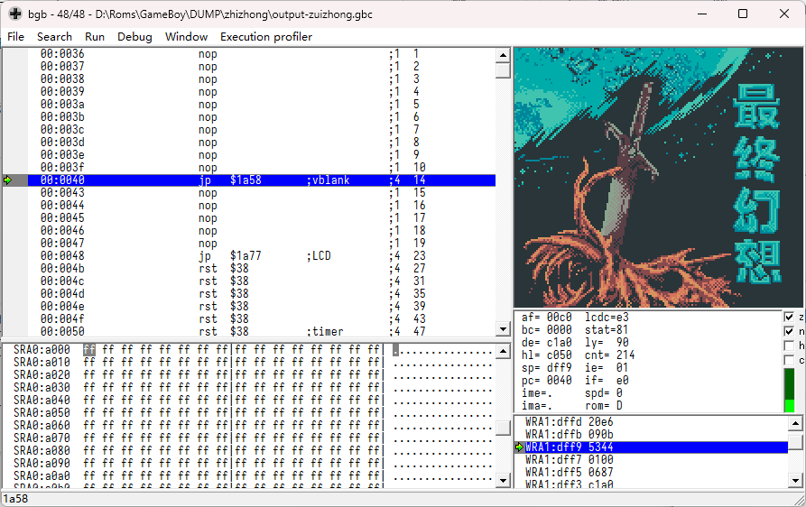

Title: GameBoy的最终幻想加密卡分析汇总
Tags: GameBoy, 加密
Slug: gameboy-zuizhong-analyze
Summary: 靠猜测完成的补丁。



和昨天的[剑侠情缘](./GameBoy的剑侠情缘加密卡分析汇总.md)同为外星科技的游戏。加密也一样。

这次这个是移植FC上的《最终幻想II》，由于曾经听说过这个游戏，因此选择先做这个游戏的修复。

# 7000加密

编写了一段代码，用于将Patch的代码转换为修订后的补丁。

相比于剑侠情缘，这个游戏跳转类的代码算是直来直去了，基本上补丁跳转的下一个位置就是新的代码。

最后一个跳转一开始猜错了，导致进游戏后没有手柄输入，找到正确的跳转位置后终于正常。


```asm
    ; Patch at $1a50
    DEF WXHP_BANK = 0
    DEF WXHP_DB_1 = $18
    wx_hotpatch $03, $4d, $bc, $0d, $c3, $f9, $3f, $9f

    ; Patch at $3310
    DEF WXHP_DB_1 = $4c ; Guess
    ; DEF WXHP_DB_1 = $57 ; Guess
    ; DEF WXHP_DB_1 = $cb ; Guess
    ; DEF WXHP_DB_1 = $d6 ; Guess
    wx_hotpatch $03, $21, $a3, $99, $cd, $aa, $24, $07
    ; org $3321
    ; call Wram_HotPatch_2

    ; Patch at $3357
    DEF WXHP_DB_1 = $8c
    wx_hotpatch $03, $54, $19, $99, $c3, $6d, $66, $16

    ; ; Patch at $2084
    DEF WXHP_DB_1 = $10 ; Unknown, some op at 0b:412b
    wx_hotpatch $03, $c5, $c2, $10, $ea, $65, $cf, $e5
    ; org $20c5
    ; call Wram_HotPatch
    ; org $20c5
    ; nop
    ; nop
    ; nop

    ; Patch at $2125
    DEF WXHP_DB_1 = $2c
    wx_hotpatch $03, $22, $30, $90, $c3, $cd, $1c, $03

    ; Patch at $0a24
    ; DEF WXHP_DB_1 = $3e
    DEF WXHP_DB_1 = $a0
    wx_hotpatch $03, $5c, $24, $05, $cd, $46, $47, $8d

```

## 猜测的修订

在 `$3310` 的补丁的内容是猜测的，虽然应该没猜错。
修订后的代码会在启动流程中进行内存初始化。
很奇怪，昨天的剑侠情缘实现了初始化，但是没有调用到。

我有一点担心，外星的加密有没有可能在上电时预设一个实际上数据错误的补丁，然后随着新补丁的生效，旧补丁失效，反倒露出原始的正确代码？
目前没有办法证实这个事情，我手上一张外星的卡都没有。

在 `$2084` 的补丁比其他的都难，因为它是把`$FF`写入一个内存地址的数据，而不是执行跳转。
目前已知的手段只能猜测是 `$C700-$C71F` 或 `$C780-$C79F` 这64个地址中的某一个。

这种补丁如果没有实际作用，只是为了屏蔽掉未补丁的错误命令还好。
如果有实际作用，在游戏运行到中期或者后期的时候给你来一个检查导致你挂掉，那就不好说了。

检查反编译代码数据，没有找到类似的代码。尝试编写不初始化这个区域的代码，也没有找到非法点。
原本计划是，直接把补丁改成给符合条件的所有内存地址都写入`$FF`算了，不过最终还是不这么搞，按外星这些游戏，说不定会引入新的故障。

在游戏的 `0b:412b` 附近，找到如下代码：

```asm
    ld a, $ff
    ld [$c433], a
    ld [$c710], a
```

而补丁的目标， `00:20c5` 附近，代码是这样的：

```asm
    ld a, $ff
    ld [$c433], a
    call [$c7??], a
```

虽然不能是一回事，但是我也找不到其他的情况了，反编译也没看出有埋藏陷阱，目前将补丁和上代码修订成一样的。

后面有问题再说。

