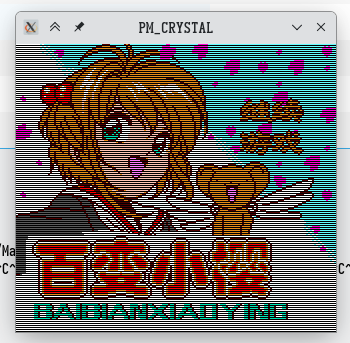
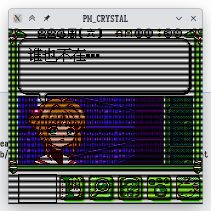

Title: GameBoy的百变小樱加密卡分析汇总
Tags: GameBoy, 加密
Slug: gameboy-sakura-analyze
Image: ../images/GameBoy/sakura/sakura1.png

分析D商汉化卡《百变小樱》的加密。

# ROM Header

常规的手段，配置文件头中错误的MBC类型，ROM的大小和SRAM的大小，让模拟器无法正常识别。

这些配置不会对实体卡和实体设备造成影响。

手动改回去就可以。

# ……调试地狱

DUMP的程序可以运行，但是封面错乱，字不对。反复跟踪了两天就是没效果。不知道什么问题。

手动将数据端 `ROM7:4000` 开始的256字节从原始ROM中复制过来，结果能正常显示原始游戏实现的标题。

汉化ROM里对应的映射区域是ROM的后512K，需要检查对应的数据。

检查一看，好家伙，后面的512K数据是前面512K数据的翻版。相当于没有正确DUMP。

不知道发生啥事，只好重新用DUMP器读取。

# 重新DUMP

用 `GBFlash` 烧录器链接 `GnuBoy` 模拟器，很奇怪，这次竟然正常通信上了，模拟器以龟速正常读取ROM。

事不宜迟，直接进行重新DUMP。重新DUMP后的ROM可以正常运行。

# 结束了？

目前看游戏没有加密（实际上我都没发现一般加密游戏存在的各种特殊端口读写）。

烧录器链接过程中似乎有观察到不正常的端口写入，但是看起来游戏整体没有这些操作。

最初的DUMP没有正常DUMP一整个ROM的原因应该是某种保护确实存在，但是经过另一些操作后被绕过了。

