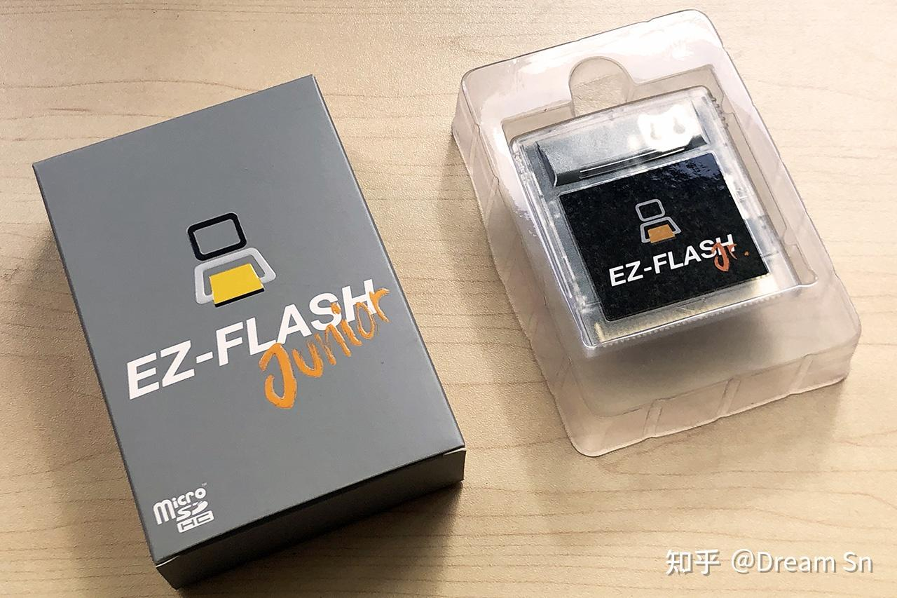
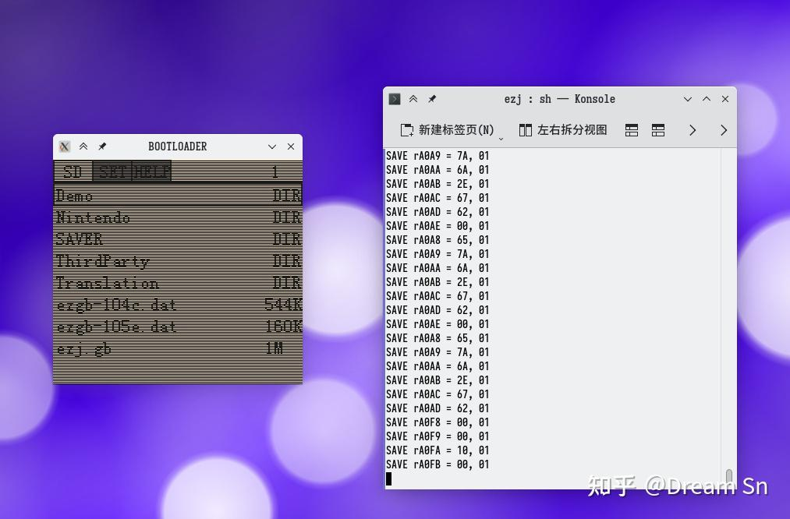

使用 `GNU Boy` 模拟 `EZ Flash Junior` 烧录卡。

> 前文复制自我原先在知乎的文章[^zhihu]。

# 什么是 EZ-FLASH Junior 烧录卡

EZ-FLASH Junior 烧录卡是一张GB/GBC烧录卡，用于在GB/GBC实机上运行GB/GBC游戏。

下面简称EZJ烧录卡。

# 为什么要模拟 EZ-FLASH Junior 烧录卡

EZJ的官方内核比较常规，使用C语言写的，在GB上进行类似位图绘制的方式实现菜单。

这个方法虽然比较常规，但是在GB上性能实在一般。如果能用汇编语言重写，性能和效果应该会更好，也能尝试实现一些官方内核没有的功能。

不过，EZJ的内核源码并没有公开，烧录卡具体运作方式，网络上已经有一些研究材料[^hwinf]用来讲解，不过有一些还是要学习实践一下看看。

因此，尝试在模拟器上模拟EZ-FLASH Junior烧录卡的固件，算是一个很好的学习过程。做出来的模拟器，后续也可以为自己重写的内核提供调试上的便利。

# 怎么模拟 EZ-FLASH Junior 烧录卡

使用GNUBOY模拟器，修改模拟器读写ROM区域和SRAM区域的行为，按照EZJ的行为来适配，进行模拟。

选择GNUBOY模拟器是因为这个模拟器是用C写的，读写的相关行为也比较简单。

GNUBOY本身在模拟GB上，某些情况别于实机，不过这些差异对模拟EZJ本身来说不重要。

# EZ-FLASH Junior 烧录卡的模拟情况

目前，SD卡本身已模拟，SRAM也已模拟。

SD卡和RAM之间的读写已模拟。

SD卡加载到ROM的命令模拟部分模拟，对单元大小4K的4G FAT32文件系统工作正常。

加载ROM后的重启，游戏ROM的MBC模拟等也已实现。

EZJ背部的RESET键也借助模拟器的RESET进行模拟。

# 还有什么要做

RTC还未模拟，使用固定的数据。 (26年更新：已完成EZJ硬件层面的RTC，MBC3内部RTC未实现)。

发布当前的代码。（26年更新：已发布在Github[^gbsrc]）。

扩充本文，这些写得只能算是一点笔记。

最重要的，实际开始编写内核。

# 实际编译和操作 （26年更新）

目前所有操作在Linux环境中运行。支持WSL2（需要支持X-Window转发）。

首先安装 `libsdl1.2-dev` （Ubuntu）。

下载源代码[^gbsrc]。在代码根目录中直接使用 `make` 编译。

编译完成后，其余所有操作在 `ezj` 目录中进行。

## 运行文件准备

需要 `stage1.gb` ，这个是EZJ在CPLD中的固件，作为第一阶段引导使用。可以从[此处](https://github.com/daid/ezflashjr/blob/master/stage1/FW5/stage1.gb)下载得到。

需要 `ezgb.dat` ，这个可以从EZJ官网下载到。

需要创建一个SD卡镜像。 创建 `sd` 目录。在目录中放置 `ezgb.dat` 和其他在SD卡中使用的文件内容。

执行 `./makesd.sh` 后，脚本将根据 `sd` 目录中的文件创建一个4G的SD卡镜像 `ezj_sd.dat` 在当前目录。文件是稀疏格式，只要根文件系统支持，实际文件大小没有这么大。

如果需要获取 `ezj_sd.dat` 里面的文件，执行 `./mountsd.sh` 将镜像挂载到 `mp` 目录中。使用 `sudo umount mp` 来卸载挂载。运行过程中请勿挂载。

## 运行

执行 `./run.sh` 将打开界面。对应按钮配置已经写入 `cfg.rc` 中，如果有需要可更改此文件生效。

[^zhihu]: [模拟 EZ-FLASH Junior 烧录卡](https://zhuanlan.zhihu.com/p/514886476)
[^hwinf]: [对EZJ硬件和寄存器的解析](https://github.com/daid/ezflashjr)
[^gbsrc]: [gnuboy-ezj源代码](https://github.com/SnDream/gnuboy-ezj)
