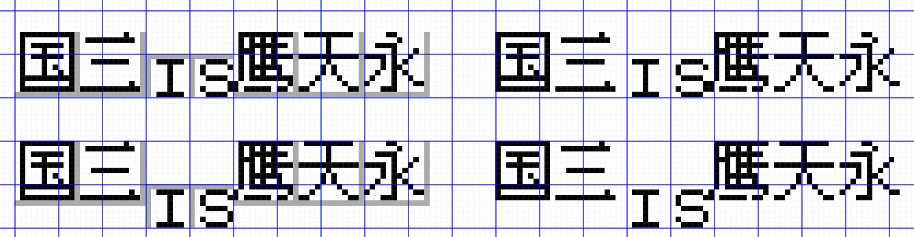

Title: 无用教程 - 游戏汉化时使用的像素字体
Tags: 像素字体, 知乎
Slug: pixel-fonts-used-in-chinese

**警告：我想你应该知道大多数字体需要商业授权。如果是商业汉化需要使用像素字体，请注意对应字体授权范围和商用条件。很多中文像素字体溯源困难，本文中列举的授权情况基本为推断，不代表实际情况。**

稍微介绍一下一般游戏汉化时使用的。主要关注GBC/FC这样的平台，不过SFC/MD/GBA之类的平台其实也能参考下。

说是选择，其实大多数时候没得选。毕竟在16x16以内，中文能用的字体和字号其实也不多，如果有小于12x12的需求，甚至可以说风毛菱角。

不过，现在的新出像素字体似乎还挺多的（我之前写的[https://zhuanlan.zhihu.com/p/142419693](https://zhuanlan.zhihu.com/p/142419693)感觉就有些过时了），或许有一些新出但我还不了解的字体，这里就不会提到。另外，下面提到的只是个人制作（民间）汉化的经验之谈，对某些风格的选择有非常个人主观的因素，不一定适合所有人。

# 在8x8区域内使用字体  
在8x8区域内的字体在游戏中非常常见，GBC/FC上海量的游戏，默认字体就这么大。

这个值也是这些机型的图块（Tile）的大小，这些机器上默认的最小图像单元就是一个图块。

  
虽然，为了汉化的美观，正常来说这些字体需要调整到12x12或者更大，但是受限于汉化技术/显存容量/显示方式等这样那样的限制，还是有直接使用8x8字体的场景。另外，某些原生使用4x8这种极小字体的游戏，汉化的汉字也会搭配8x8来使用。

虽然说是8x8字体，但是实际上使用的字一般只有7x7，因为硬件上不可能帮我们额外增加间距（否则我们也没必要用这么小的字体），所以需要在8x8内预留1px来作为间距，剩余7x7给字体使用。

  
虽然也有人选择使用真8x8的字体，不过这种没间距的字体会造成粘连，我个人不太喜欢这种效果。

在FC上，有一种变通的方法，是给每个字都加个空格，这样虽然不粘连，但是间距就很大了，另外这种方式很难避免纵向上的粘连，毕竟横向可以加空格控制，纵向和什么文本连着完全看游戏原本的程序，本身用这样的字体很多时候就是不会或者不好改程序。

  
另外一种变通的方法，是使用11x7的字体。相当于用3个图块来显示2个汉字的内容。在高度限制和显示效果之间保持平衡的一种方式。不过似乎很多人不喜欢这种不是正方形的字体。

  
另外，有一些人会选择用工具直接生成8x8的字体，多出现在民间汉化，说实话没有人工介入生成这么小的字模，结果都挺难看的……

而D商汉化倒是不多见机器生成的8x8字模，取而代之的则是各种奇形怪状的8x8手绘字模，里面充满着各种别扭的对齐以及手写级别的简化，我仍记得D商绿宝石的8x8字体手绘，把魔字直接化成庅来用……

## 可用字体  
具体到可用的8x8字体，有如下的可用：

* 小点阵（XiaoDianZhen）：某种日文苹果点阵字体补充中文点阵的字体，字内粘连很小，我个人多喜欢用这个（因为以前只知道这个）。授权处于灰色地带。
* 观致点阵体：日文开源字体Misaki补充中文点阵的字体，中文点阵部分的补充似乎与小点阵是同一人所作。理论上应该是CC0授权。
* 丁卯点阵体：一整套专业设计的简体中文点阵字体。使用需要商业授权。  
Small Simsun 8号（小宋体）：一个扩充XP宋体的字体，最小的字号是不带间距的8x8，实际应用容易出现粘连问题。
* ColorStyle（彩色风格）：我个人按中易宋体压缩修订的字体，仅覆盖GB2312一级字。授权处于灰色地带。
* 其他更多：近期有很多新增的8x8大小的字体，不过我没有在汉化中用过，所以不太了解，可以自行搜索下。

  
# 在8x16区域内使用字体  
部分游戏会选择8x16区域来显示字体。一种比较常见的情况是用一个8x8图块来显示假名，而假名的清浊音记号用上方的8x8图块来显示，两个图块合为一个8x16的区域。

  
  
对于汉化来说，直接扩充成12x12或者16x16可能是一个比较好的选择，但是扩充不了的时候，就不得不用这种字体了。

虽然区域大小是8x16，不过一般很少有真的占满整个8x16的，这样的字体说实话太长太奇怪了。理想情况下，使用7x11的字体。

## 可用字体  
实际上，没有什么好用、可用的字体……

iQue在火纹战记中使用的字体勉强可以算一个，但是这个是一个8x11大小的字体，在GBA上的实际使用会额外增加间距（也就是没有图块的限制），效果就比较正常。但是在GBC/FC上使用会出现字体粘连。

  
  
不过，还是把我已知可能的方案列一下吧。

* “iQue字体”：虽然是从神游的ROM里提取的，但是字模数据和民间汉化火纹中使用的一样的，算是一笔我搞不明白的烂账。实际使用会出现上面提到的粘连，另外由于神游（或者民间汉化组）并没有完整做出全部字符的字模，因此使用过程中可能需要使用者自行补充一些缺少的字模。授权处于灰色地带。
* CrystalTile程序直接使用中易宋体机器压缩成8x11字模。不能说好看，但是勉强能看？授权处于灰色地带。
* 丁卯点阵体的7x9版本：目前（22年10月）应该是还在设计，未发布。显然会是一个商业授权字体。
* 自己手绘：艰苦的工作。印象中有一个皇家骑士团的繁体中文汉化是汉化者自己手绘的全套字体，不过这个汉化获取条件很严苛，我没特意了解详情过。
* 修改程序，实现为12x12的字体，不过实际，总是有这样的那样的限制的，不是那么好修改的。

  
# 在12x12区域内使用字体  
这是一种很典型的使用方法，大量的民间非D商汉化的游戏都选择了这种方式来显示字体。

这种显示的方式，程序上的难点在于，图块的最小单位是8x8，对于12x12的区域，相当于有些图块需要分给两个汉字使用，程序上需要能实现拼接。但是如果能实现，效果可以说是很好的。

和前面8x8类似，一般字体会留1px的宽度，也就是11x11。

这个大小的王者，自然是中易宋体，在海量的汉化游戏都在使用这个字体，原因无他，XP及之前系统的默认字体。目前新汉化的游戏，开始出现了一些方正宋体，同样是系统默认字体带来的影响。

  
  
从这个大小开始，出现了一些风格化的字体，比如Zpix，以及被人熟知的仿宋和楷体。不过驾驭这些字体的难度个人感觉还是挺大的，没什么额外需求，还是建议使用中易宋体。有关风格化字体，更多的内容会在后面实际应用中展开说明。

  
## 可用字体  
* 中易宋体9号（XP时代系统里的“宋体”）：属于万金油字体，在汉化内应用广泛。对于Win7之后的使用，一般选择安装一套叫Small Simsun的字体来避免影响系统的宋体（但是实际上Small Simsun的非汉字部分与原版中易宋体有些有差异，不过问题不大）。授权处于灰色地带，实质上被广泛使用在各种产品中，包括神游官方汉化的游戏里。
* 方正宋体（Win7时代系统里的“宋体”）：个人不太喜欢这套字体，看起来显得太肿，显得比较别扭，不过毕竟是当下Win系统的默认字体，不少汉化者会直接用这个生成字模。另外这个实际上是一个12x11的字体。授权属于可能要人命的地带，反正我不敢用。
* 文泉驿点阵：一个理论可用，但是Win环境不太好调出来的字体（至少我目前就不能简单给出来，发布说明说Windows用正黑就带有嵌入点阵，但是我的程序无法识别里面的嵌入点阵）。默认授权是GPL，商业使用须注意，有单独给商业游戏重新授权的例子。
* 最像素（Zpix）：笔划处理比较不传统的字体，我个人比较喜欢这种字体和比较科幻风的游戏搭配使用。民间汉化可使用，商业使用须授权。
* 仿宋_GB2312：这么小的字号能设计出仿宋本身就是很厉害的事情。不过实际使用的时候有点难阅读，另外其实很少有什么汉化的场景一定要用这个字体不可，可以在游戏有双字体时用这个字体作为次级字体来用。授权处于灰色地带。
* 楷体_GB2312：同仿宋，不过可读性更差一些。授权处于灰色地带。
* 中易宋体10号：比常用字体大一号，占满12x12（也就是会粘连），部分D商游戏会这么用。授权处于灰色地带。
* HZK12：UCDOS中的字模数据，同样占满12x12。目前使用，一般选择安装一套叫凤凰点阵体的字体来使用。授权处于灰色地带。（请注意凤凰点阵体上描述的开源授权仅针对其生成程序，作者本身并没有HZK的版权）
* (P?)MingLiU：如果做繁中汉化，可以考虑的字体，简体中文使用时有些字形还挺怪的。授权处于我不知道地带。

  
  
# 在16x16区域内使用字体  
在这个级别，理论上应该有很多可以用的字体了，但是实际情况比较尴尬。

首先是比较常用的宋体，理论上这个字号应该很容易生成，但是不知道简体中文点阵字库基于什么样的考虑，纷纷选择使用15x16的空间来放16x16的点阵（可能是被标准带歪了），与8x8的粘连情况类似，直接使用这么大的字体，纵向会出现粘连情况。

  
相比之下，繁体的点阵字库一般设计成15x14或者15x15，这样就不会出现粘连的现象了。

  
简体中文曾经也有商业点阵字库有15x14的方案，在先锋卡通汉化的吞食天地2中就使用这样的字库，先锋卡通相关的文章曾经提到过他们（使用自研字库？）生成12x12点阵字库的事情[^xf]。但是目前我是没有见过对应的点阵现代字体版本，或者完整的点阵数据来源。

[^xf]: [https://zhuanlan.zhihu.com/p/21767453](https://zhuanlan.zhihu.com/p/21767453) .

  
在这种情况下，建议使用宋体时退而求其次，使用14x14的字号，这样至少每个字不会粘连起来。

  
另外，可能出于某种惯性或者习俗，又或者某些默认工具配置。有很多民间汉化选择在16x16的区域中还是使用11x11的字号。这样的间距很大，除非原始游戏字体就是这个效果，个人不太喜欢这种使用方式。

  
然后，对于黑体。到了16x16，已经有黑体点阵可以使用了，不过这套黑体点阵的质量，粗看还凑合，细看会觉得不是很整洁。有关黑体点阵，更多的内容会在后面实际应用中展开说明。

  
## 可用字体  
* 中易宋体11号：实际占据14x14的体积，效果比较好。授权处于灰色地带。
* 中易宋体12号：民间汉化、D商汉化实践中使用比较多的字，因为调配出来最简单。占据15x16的体积，纵向会粘连。授权处于灰色地带。
* 黑体：有点阵，但是点阵效果很一般，前面也说了，属于粗看能看，细看感觉不是很整洁。授权处于灰色地带。
* 粗宋：曾经被小霸王和先锋卡通使用过的点阵字体。最近又再次流行起来，个人认为可以作为黑体的替代用字。实际占据16x16，但是由于2px的笔画到了边缘一般会处理成1px，所以虽然有粘连，但是看过去效果还不错。理论上属于开源字体。
* Unifont：你可能在《我的世界》里见过它，不过我个人还没有见过民间（主机/掌机游戏）汉化用这个字体的。实际占据15x16。可商用的开源字体。
* 文泉驿字体：字体情况和12x12类似，不再重复介绍。
* 方正宋体：字体情况和12x12类似，不再重复介绍。再次提醒注意：授权处于可能要人命的地带。
* 楷体_GB2312、仿宋_GB2312：字体情况和12x12类似，不再重复介绍。楷体和仿宋在这个字号的细节更多了，但是不见得会有很多实际的汉化场景能使用到这些风格的字体。
* 其他我还不知道的：近年来新增了一批像素字体，其中或许有我还不知道，但是实际应用非常好用的字体，可以自己尝试去找找看。

  
# 在更大的区域内使用字体  
我目前还没有见到过8位/16位游戏汉化中在标题之外的地方需要用超过16x16的字体。真的大于16x16的分辨率的需求，可以考虑用矢量字体生成像素字体，这里不再展开。

# 汉化实际应用的考虑  
## 用字数量  
用字的数量直接影响对字的处理方式。

如果只需要制作少量的字模，用在标题或者章节名等位置，可以考虑基于某种现成字体作为基本，然后手动调整点阵。下面就是一个实际汉化中的例子，左边是最终游戏的效果，右边是作为基本字体的黑体原始的效果，通过调整笔画来与原始的日文字体相匹配。（当然，这例子里面还做了一些过渡色）

  
  
不过，更多的时候，一般是RPG类游戏需要生成成百上千个字模数据。这个时候基本上难以一个个字去修改，不过在实际应用中，RPG使用的字体也不会有很浓重的风格，使用中易宋体就能搭配使用。

  
## 字重  
绝大多数的时候，像素字体的字重都只有1px，毕竟单字可用的区域本身就不大，螺蛳壳里还真就不好做道场。

不过，少数情况下，还是存在使用字重为2px的场景（更高的字重我没听说过）。下面列举一些，可以根据实际原始情况搭配。

最简单的方式，就是直接把1px加粗，一般是将字体横向重叠来使得文字更粗，这是Windows下粗体的一种默认实现方法。这种使用方法见仁见智，如果游戏的原始字模生成也是这样加粗的，那么你这么用也可以。对于汉字来说，整体会不那么好看，但是也没有到不能看的地步。

  
另外，我从没见过有人做过纵向加粗，估计是太难看了。

  
另外，有一种粗体的方法，会在加粗时避开粘连，Java的默认GUI（大概是这么叫？我见过的Java实现的图形程序大多这样）中实现的汉字粗体就是这种效果。（下面例子的前两行）

这种方式相当于一种对加粗笔画的扩充，在横向重叠后进行额外的透明重叠，来强制新增的重叠部分不与原先的笔画粘连，由于原先的笔画也会加粗祸害更右边的像素，因此不会出现某个笔画被透明重叠完全删除的情况。不过这种方式的笔画会出现粗细不一的现象，原本竖直的笔画也会因为透明重叠的“侵入”，出现缺口。

于此相似的一种实现是横向重叠的像素如果粘连就直接不重叠，效果差不多，缺口的像素点位置不太一样。（下面例子的后两行）

  
  
如果希望字体不仅是横向，纵向也要加粗，或者觉得上面的通过重叠的方式加粗的字体不好看，可以考虑用本身就是2px的字体。不过这基本上只有16x16的可选。有两个选择，一个是黑体，一个是粗宋。个人推荐使用粗宋，黑体的话，就和前面提到的一样，少量且人工介入修订时可以用用。

  
这里有一个应用粗宋的例子，不过看上去原始的字体就是用某个字体直接加粗的，汉化字体里直接做成加粗也没什么很大的区别。

  
对于12x12的小字，虽然不排除有人能设计类似粗宋那样的12x12字体，但现实是目前简体中文点阵字体应该还没有这样的字体（日文字体倒是有），可能只能用加粗的方式对付一下。

对于更小的，比如小到8x8的字，基本上都不太可能做加粗。在极少但不排除的情况，比如修图（特别是英文游戏）中出现小字体英文粗体且汉化硬要对应的场景（比如加粗做强调，如果全部都是加粗字体，中文就没必要加粗），可以考虑只给最靠左或者最靠右的边缘加粗。由于除了修图外也很难做边缘加粗，下面的图中的边缘加粗没有按正常Tile对齐。做出来挺难看的……

但是，个人其实建议直接用【】等符号的方式来直接作为文本加重的提示，没必要在这么小的字上再抠字重了。英文小点阵可以玩粗体，中文实在是跟不起。

  
## 斜体  
有一说一，我没有见过在汉化中必须用斜体的场景。原本的点阵字体就少有斜体，计算机生成斜体点阵时很有可能不是根据点阵数据，而是用矢量数据变形斜体后再转回点阵的，效果及其难看。

如果真的有斜体需要，建议将点阵字体从中部做一个像素的偏移意思一下就是了，如果喜欢可以多找几个部位偏移。当然还是建议别折腾这种……

  
## 对齐  
这个字体设计师好像有一个专门的叫法，我就不太了解了，这里姑且就叫做对齐。

主要涉及原始的8x8字体和更大的汉字字体的对齐。

前面有说过，Tile是正常最小的显示单元，一般来说，原始的英文字符会正好占据一个8x8的空间，理想的设计中，汉字的显示和英文的显示垂直居中对齐可能比较好看，但是这样对于汉字的显示就比较困难。

  
下面是三种对齐的方法。

第一种是实际应用中比较常见的作法，也是你看到的汉化游戏中很典型的做法，只做垂直底对齐。

第二种将英文字符上提处理，实际上就是把原本8x8的字符当成8x16来处理了，这种做法在实际应用中存在，但是不一定适用所有游戏。比较典型的一种情况是，表示数字的Tile一般是固定的十个Tile（0到9）来静态存储在VRAM里，你要做这样的修改，至少得从VRAM里再找十个固定的Tile空间来让你的8x8修改成8x16，这个对于寸土寸金的8位机VRAM来说往往是很困难的。

第三种就更离谱了，为了实现垂直居中相当于汉字要多用原来50%的Tile数量，来达成貌似对齐的效果，实际操作中会受到上下行对齐、边界等多重影响，基本上很难实施，但是也不是没有，至少我自己就曾经做过类似的代码。

  
另外你可能注意到前面的例图中有一个“这里是29号道路”，数字前面有一个小间隙。这个也是与Tile有一定关系，12x12的汉字要放入8x8的空间，需要进行拼接，但是对应的程序是否和原始的英文字符拼接呢，得看实际游戏程序情况和对应的游戏破解的编程情况，实际汉化存在或者不存在这个间隙都是有可能的，这里不展开。

  
间距的放置位置也与对齐有关。一般需要让汉字与原始英文保持同向的间距位置，这样汉字和英文混排就不会出现粘连，另外虽然不同大小的字做垂直中心对齐在硬件上限制比较多，但是让字保持一个垂直底对齐或者垂直顶对齐还是可以的，这样显示也比较自然。

  
这里举个反例，这些和前面的四个例子在硬件的限制上没有区别，但是看过去就非常别扭了。

  
## 字体本身的风格  
实际汉化中，很少见作为参考的原始字体，特别是日文的原始字体会以一种很花俏的风格来显示。给我留下比较深的印象的也就是GHOST TRICK里的字体，（顺便，汉化组将其处理为发布两个版本，一个是接近原始字体的“铁筋隶书”版，另一个则是普通的宋体字版本）。

  
更多时候，虽然日文字体的选择来得比中文多，不过实际上也没有那么多可选项，或者为了整体可读性，选择出来的字体多是没什么风格的字体。而从英文版汉化游戏，有时候原始的英文会使用花体等比较华丽的风格，这个时候与其牵强附会使用仿宋或者楷体之类的字体，不如直接参考一下日文版的实现，或许日文版用的也是平平无奇的宋体呢。

另外，如果原始字体风格确实比较重，那么原始的游戏开发者为了提升这些字体的可读性，往往会对字库增加过渡色以支持更好的显示效果，这种情况下可以考虑用矢量字库生成类似风格的字体，正常情况下不推荐用矢量字库的原因主要是矢量字库二值化出来的点阵大多相当难看，如果有过渡色支持，矢量字库的效果就会好上非常多，甚至有时比直接用点阵字库还要好。

当然，如果你对你汉化的游戏能投入比较高的资源，你可以考虑自己画一套来搭配风格，相当于做一份繁重的美工。

  
## 字模生成时附加的风格  
字模生成有时候会附加一些本不属于字体的风格，主要是为了提高游戏中的可读性等，这个风格与原始游戏保持一致即可，下面列一些比较常见的场景，CrystalTile等工具生成字模时支持配置下面大多的风格。

  
这一部分相对简单（只是可能要编程加持），即便有更复杂的组合或者实现，只需要理解原始字体的生成方式，模仿生成即可。

# 结语  
感觉可能还有些什么没写，罢了，本来汉化就不是什么标准化流程，八仙过海各显神通吧。

实际应用中可能有用但是比较紧缺的，可能是点阵实现的圆体，这个目前还没有见过简体中文的点阵字体有，也许用现成字体利用算法稍微调整一下可能比较好看点？
